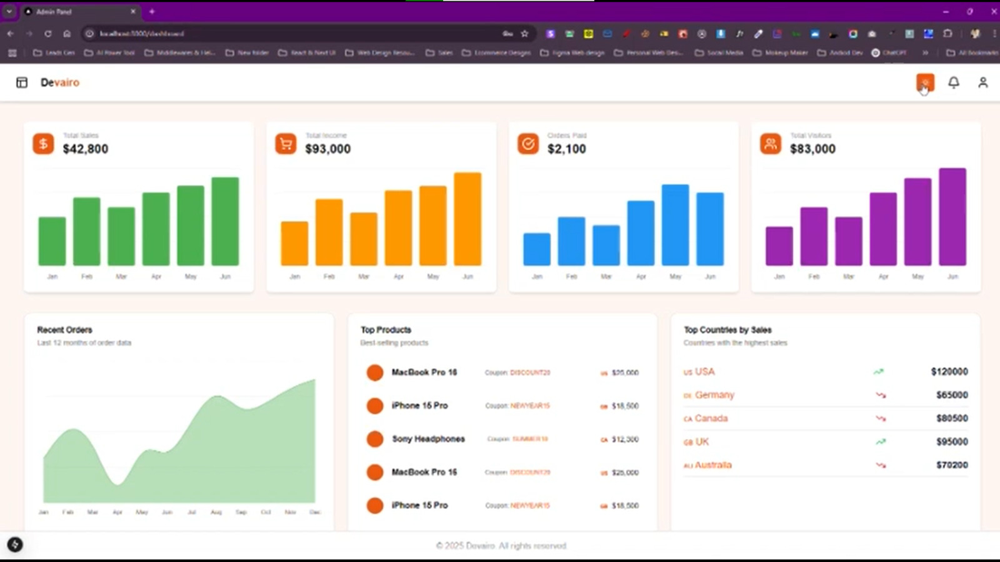
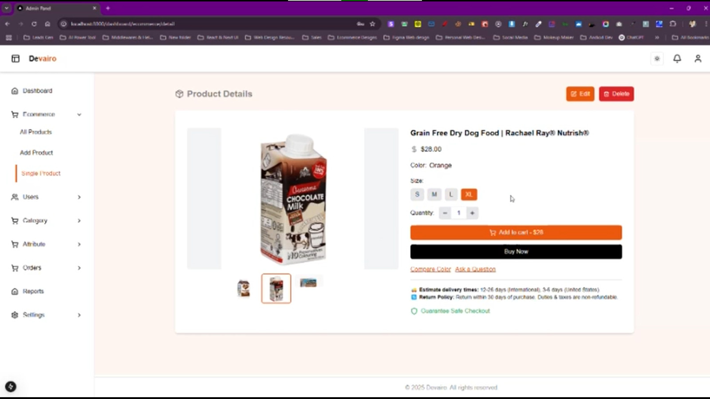
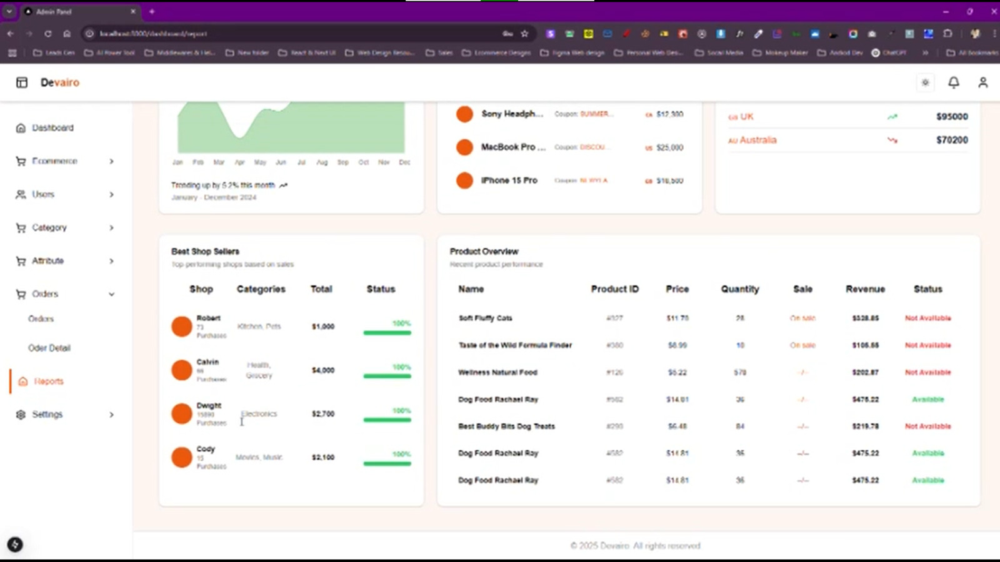

# 🧠 Ecomerce Agentic AI Admin Panel

### An AI-Powered Multi-Brand eCommerce Management System

**Ecom Agentic Admin Panel** is a full-stack web application designed to provide **multi-brand eCommerce management**, **AI-powered analytics**, and **automation features** — enabling brands to efficiently run and monitor their online stores from a unified, intelligent dashboard.

> 🧩 This project is being developed as our **Final Year Design Project (FYDP)** under the leadership of **Muhammad Umer (Team Lead)** with a dedicated and talented team.

---

## 🚀 Tech Stack

**Frontend**
- React.js  
- Next.js  
- Tailwind CSS  
- ShadCN/UI  

**Backend**
- Node.js  
- FastAPI (Python)  
- MongoDB  

**AI & Data Layer**
- Grok (LLM Integration)  
- Pandas  
- Custom-built AI models  

---

## 🧩 Core Features

✅ Multi-brand eCommerce management system  
✅ Real-time product, order, and user dashboards  
✅ AI-powered store insights and visual analytics  
✅ Role-based authentication & secure access  
✅ Modern and responsive UI  
✅ Integration of custom AI modules  
✅ Scalable backend with FastAPI + Node.js  

---

## 🧠 Upcoming (AI Integrations)

> 🚧 These features are currently in development and will be included in upcoming phases.

- 🤖 **Agentic AI for Store Automation** – autonomous decision-making for brand operations  
- 🛒 **AI Recommendation Engine** – personalized suggestions for customers  
- 💬 **AI Chat System** – interact with store data using natural language  
- 📈 **Predictive Analytics** – future trend forecasting for products and sales  
- ⚙️ **AI-driven Inventory Optimization**

---

---

## 🎬 Project Demo & Visuals

### 🖥️ Dashboard Preview
<p align="center">
  
</p>

### 📊 Products Insights
<p align="center">
  
</p>

### Product
<p align="center">
  
</p>

---

### 🎥 Watch the Demo Video
<p align="center">
  <a href="https://youtu.be/YOUR_VIDEO_ID" target="_blank">
    
  </a>
</p>

> 📹 Click the image above to watch the full video demonstration on YouTube.


## 🛠️ Installation & Setup

Clone the repository:
```bash
git clone https://github.com/umerakramk15/devairo_Ecom_Admin.git
